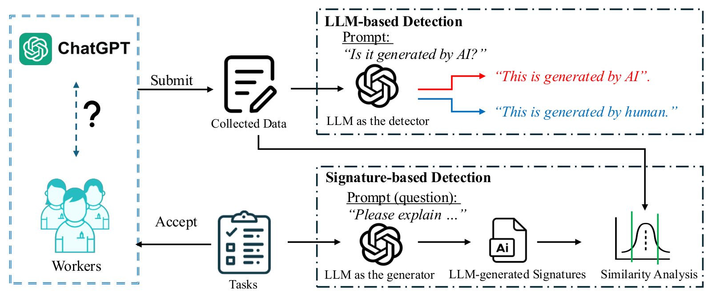
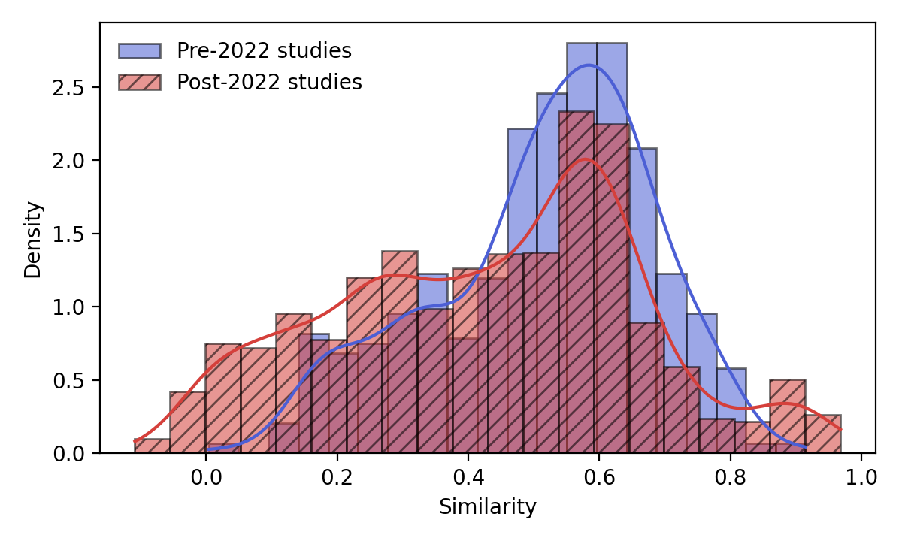

# Detecting GenAI in Crowdsourced Surveys

**Detecting the Use of Generative AI in Crowdsourced Surveys: Implications for Data Integrity**

Dapeng Zhang, Marina Katoh, Weiping Pei · *CSCW 2025 Workshop: Beyond Information: Online
Participatory Culture and Information Disorder* · [arXiv:2510.24594](https://arxiv.org/abs/2510.24594)

Crowd workers can answer open-ended survey questions with ChatGPT in seconds, and the result
reads like a real respondent. This repository contains two ways of detecting such answers, the
prompts and generated signatures behind them, and per-response results for seven survey studies
run between 2021 and 2024, from which every table and figure in the paper can be rebuilt.

## How it works

<p align="center">
  
  <br>
  <em>The framework of GenAI detection in crowdsourced surveys.</em>
</p>

**LLM-based detection** uses the LLM as a *detector*. Each response is shown to a model with the
question "Is the following generated by an AI or written by a human?", and the model answers 1
or 0 (zero-shot, temperature 0).

**Signature-based detection** uses the LLM as a *generator*, from the survey designer's side:

1. **Generate signatures.** Before (or after) fielding the survey, ask LLMs to answer each
   open-ended question themselves, across 4 models and 5 temperatures (0 to 1). The basic prompt
   is the question alone (20 signatures per question); the sentiment-based prompt also asks for a
   positive, neutral and negative answer (60 per question).
2. **Embed.** Encode every collected response and every signature with SBERT
   (`all-MiniLM-L6-v2`).
3. **Score.** A response's score is its highest cosine similarity to any signature for the same
   question.
4. **Flag.** Responses scoring at or above a threshold (0.7 to 0.9) are flagged as likely
   AI-generated. Scores near zero or below are informative too: they often mark answers that
   ignore the question.

Every prompt, with its settings and a rendered example, is documented in
[`prompts/README.md`](prompts/README.md).

## Results

Surveys run before ChatGPT's release serve as a reference: their responses are assumed to be
human-written, so anything flagged there is a false positive.

**LLM-based detection** (share of responses labelled AI-generated):

| Model | Avg. pre-2022 (#1 to #4) | Avg. post-2022 (#5 to #7) |
|---|--:|--:|
| GPT-3.5-Turbo | 6.16% | 30.55% |
| GPT-4 | 42.25% | 53.66% |
| GPT-4o | 41.20% | 55.94% |
| GPT-4o-Mini | 9.93% | 38.61% |

GPT-3.5-Turbo has the lowest false-positive rate on the pre-2022 studies, and about 30% of
post-2022 responses are flagged.

**Signature-based detection** at similarity threshold 0.9:

| Prompt | Pre-2022 (#2 to #4) | Post-2022 (#5 to #7) |
|---|--:|--:|
| Basic | 0.16% | 2.12% |
| Sentiment-based | 0.47% | 3.29% |

<p align="center">
  
  <br>
  <em>Similarity to the closest signature (basic prompt). Post-2022 responses have more mass near
  1, where answers closely match an LLM's, and near 0, where answers are off-topic.</em>
</p>

Numbers are from the paper. The full per-survey tables are rebuilt by `python -m detect.evaluate`
into [`results/table2.csv`](results/table2.csv) and [`results/table3.csv`](results/table3.csv), and
[`results/paper_check.csv`](results/paper_check.csv) lists every recomputed cell next to the
published one (see [Reproducibility](#reproducibility)).

## Surveys

| Survey | Date | Responses | Domain | Platform |
|---|---|--:|---|---|
| #1 | 03/21 | 798 | IoT | MTurk |
| #2 | 06/21 | 170 | Software (app users) | Reddit / Craigslist |
| #3 | 06/21 | 313 | Software (non-app users) | Reddit / Craigslist |
| #4 | 09/21 | 160 | Crowdsourcing | MTurk |
| #5 | 07/23 | 1,166 | Energy | MTurk |
| #6 | 03/24 | 198 | Software | Prolific |
| #7 | 06/24 | 520 | Cybercrime | MTurk |

Survey #1 collected interaction-based answers and is excluded from signature-based detection.
The responses themselves are not redistributed (see [`data/README.md`](data/README.md)).

## Repository layout

```
genai-survey-detection/
├── detect/
│   ├── zero_shot.py      LLM-based detection
│   ├── signatures.py     signature generation (basic and sentiment-based)
│   ├── similarity.py     SBERT embedding and max cosine similarity
│   ├── evaluate.py       Tables 2 and 3, Figure 2, comparison with the paper
│   └── common.py         models, temperatures, prompts, OpenAI client
├── prompts/              every prompt used, with a README
├── data/
│   ├── questions.json            survey questions
│   ├── signatures/               the generated signatures
│   ├── zero_shot_labels.csv      per-response labels from each model
│   └── similarity_scores.csv     per-response similarity scores
├── results/              Tables 2 and 3, Figure 2, paper comparison (generated by detect.evaluate)
└── docs/                 framework figure
```

## Setup

```bash
git clone https://github.com/ChanningZhangLGB/genai-survey-detection.git
cd genai-survey-detection
pip install -r requirements.txt
export OPENAI_API_KEY=...      # only needed to query models, not to rebuild the results
```

## Usage

**Rebuild the paper's results** from the released data (no API key needed):

```bash
python -m detect.evaluate
```

**Run the detectors on your own survey.** Put the responses in a JSONL file, one per line:
`{"id": ..., "survey": ..., "question_id": ..., "text": ...}`, and the questions in a JSON list
of `{"survey", "question_id", "question"}`.

```bash
python -m detect.zero_shot responses.jsonl --out labels.csv
python -m detect.signatures questions.json --strategy basic --out signatures.jsonl
python -m detect.similarity responses.jsonl signatures.jsonl --out scores.csv
```

The hosted models change over time, so regenerated labels and signatures can differ from the
released ones.

## Reproducibility

`python -m detect.evaluate` reproduces all 60 cells of Table 3 and 21 of the 28 cells of Table 2
from the released data. The other seven, on surveys #3, #5 and #7, differ by 0.02 to 4.0 points;
`results/paper_check.csv` marks them. Two properties of the recorded data are documented in
[`data/README.md`](data/README.md): the basic-prompt scores behind Table 3 cover 12 of the 20
signatures for surveys #2, #3, #4 and #7, and the survey #7 question texts carry leftover
formatting codes. `python -m detect.evaluate --basic-column sim_basic_all20` rebuilds Table 3 with
all 20 signatures; at the 0.9 threshold the rates become 0.16% pre-2022 and 2.18% post-2022.

## Citation

```bibtex
@misc{zhang2025detecting,
  title         = {Detecting the Use of Generative {AI} in Crowdsourced Surveys: Implications for Data Integrity},
  author        = {Zhang, Dapeng and Katoh, Marina and Pei, Weiping},
  year          = {2025},
  eprint        = {2510.24594},
  archivePrefix = {arXiv},
  primaryClass  = {cs.HC},
  doi           = {10.48550/arXiv.2510.24594},
  note          = {CSCW 2025 Workshop: Beyond Information: Online Participatory Culture and Information Disorder}
}
```

## License

The code is released under the [MIT License](LICENSE).
